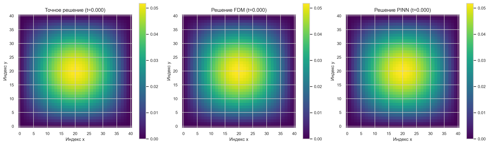
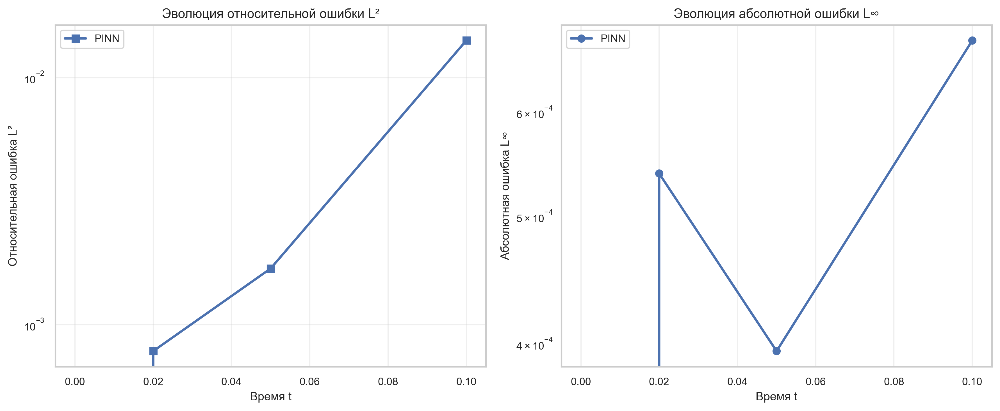
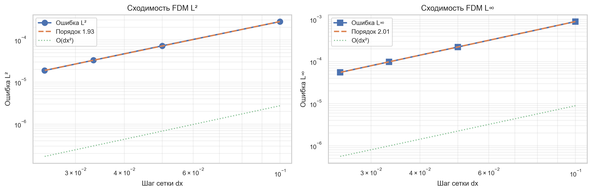
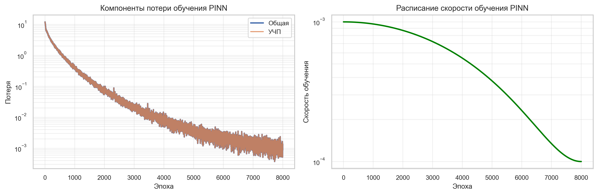

# Отчет по валидации: FDM vs PINN для 3D уравнения теплопроводности

---

## Резюме

Данный отчет представляет собой всестороннюю научную валидацию и сравнение двух фундаментально разных подходов к решению нестационарного трехмерного уравнения теплопроводности с граничными условиями Дирихле:

1. **Метод конечных разностей (FDM)** — Классический численный подход с использованием явной схемы Эйлера и векторизацией в JAX
2. **Физически-информированные нейронные сети (PINN)** — Подход машинного обучения, обеспечивающий выполнение ограничений УЧП через автоматическое дифференцирование

Оба метода валидируются на аналитически известном тестовом случае, что позволяет провести количественную оценку ошибок и анализ сходимости.

---

## 1. Постановка задачи

### Математическая модель

Мы решаем нестационарное уравнение теплопроводности в кубической области:

$$
\begin{align}
\frac{\partial u}{\partial t} &= \alpha \left( \frac{\partial^2 u}{\partial x^2} + \frac{\partial^2 u}{\partial y^2} + \frac{\partial^2 u}{\partial z^2} \right) \\
&\text{в } \Omega = [0, L_x] \times [0, L_y] \times [0, L_z], \quad t \in (0, T]
\end{align}
$$

### Граничные и начальные условия

- **Граничные условия (Дирихле):** $u(x, y, z, t) = 0$ на $\partial \Omega$ для всех $t > 0$
- **Начальное условие:** $u(x, y, z, 0) = \sin\left(\frac{\pi x}{L_x}\right) \sin\left(\frac{\pi y}{L_y}\right) \sin\left(\frac{\pi z}{L_z}\right)$

### Аналитическое решение

Используя метод разделения переменных, точное решение имеет вид:

$$
u(x, y, z, t) = \exp(-\alpha \lambda t) \sin\left(\frac{\pi x}{L_x}\right) \sin\left(\frac{\pi y}{L_y}\right) \sin\left(\frac{\pi z}{L_z}\right)
$$

где спектральная скорость распада:

$$
\lambda = \pi^2 \left( \frac{1}{L_x^2} + \frac{1}{L_y^2} + \frac{1}{L_z^2} \right)
$$

### Тестовые параметры

| Параметр | Значение | Единица |
|----------|----------|---------|
| Длина области | $L_x = L_y = L_z$ | 1.0 | — |
| Коэффициент температуропроводности | $\alpha$ | 0.1 | м²/с |
| Конечное время | $T$ | 1.0 | с |
| Размеры сетки (FDM) | $N \in \{11, 21, 31, 41\}$ | — |
| Точки сетки (PINN) | $21^3$ (оценка) | — |

---

## 2. Численные методы

### 2.1 Метод конечных разностей (FDM)

**Пространственная дискретизация:** Центральные разности второго порядка

$$
\frac{\partial^2 u}{\partial x^2} \approx \frac{u_{i+1,j,k} - 2u_{i,j,k} + u_{i-1,j,k}}{\Delta x^2}
$$

**Временная дискретизация:** Явная схема Эйлера

$$
u^{n+1}_{i,j,k} = u^n_{i,j,k} + \Delta t \cdot \alpha \cdot \nabla^2 u^n_{i,j,k}
$$

**Условие устойчивости (CFL):**

$$
\Delta t \leq \frac{(\Delta x)^2}{6 \alpha} \text{ (для 3D)}
$$

**Детали реализации:**
- Векторизация на базе JAX с использованием `jax.lax.scan` для интегрирования по времени
- JIT-компиляция для производительности
- Граничные условия с фиктивными ячейками (явное обнуление на каждом временном шаге)

### 2.2 Физически-информированные нейронные сети (PINN)

**Архитектура:**
- Многослойный перцептрон с $n_h$ скрытыми слоями ширины $w_h$
- Активация: $\tanh$
- Вход: $(x, y, z, t)$
- Выход: $u(x, y, z, t)$

**Функция потерь:**

$$
\mathcal{L} = \lambda_{PDE} \mathcal{L}_{PDE} + \lambda_{BC} \mathcal{L}_{BC} + \lambda_{IC} \mathcal{L}_{IC}
$$

где:
- невязка в точках коллокации:

$$
\mathcal{L}_{PDE} = \frac{1}{N_r} \sum_i \left( \frac{\partial u_\theta}{\partial t} - \alpha \nabla^2 u_\theta \right)^2
$$ 

- граничное условие:

$$
\mathcal{L}_{BC} = \frac{1}{N_b} \sum_i u_\theta(x_i, y_i, z_i, t_i)|_{\partial\Omega}^2
$$

- начальное условие:

$$
\mathcal{L}_{IC} = \frac{1}{N_c} \sum_i (u_\theta(x_i, y_i, z_i, 0) - u_0(x_i, y_i, z_i))^2
$$

**Оптимизация:**
- Оптимизатор Adam с экспоненциальным затуханием скорости обучения
- Жесткое выполнение ограничений через преобразование выхода

---

## 3. Метрики ошибок

### 3.1 Относительная ошибка L²

$$
e_{L^2} = \frac{\|u_{pred} - u_{exact}\|_{L^2}}{\|u_{exact}\|_{L^2}} = \frac{\sqrt{\sum_{i} (u_{i} - u_{i}^*)^2}}{\sqrt{\sum_i (u_i^*)^2}}
$$

### 3.2 Абсолютная ошибка L∞

$$
e_{L^\infty} = \|u_{pred} - u_{exact}\|_{L^\infty} = \max_i |u_i - u_i^*|
$$

### 3.3 Относительная ошибка L∞

$$
e_{L^\infty, rel} = \frac{\|u_{pred} - u_{exact}\|_{L^\infty}}{\|u_{exact}\|_{L^\infty}}
$$

---

## 4. Результаты валидации

### 4.1 Анализ сходимости (FDM)

Следующая таблица показывает сходимость относительно измельчения сетки при $t = 1.0$:

| Размер сетки $N$ | Число узлов | $\Delta x$ | Отн. L² ошибка | Абс. L∞ ошибка | Временной шаг ($dt_{CFL}$) |
|---|---|---|---|---|---|
| 11 | 1,331 | 0.1 | 5.27e-03 | 8.91e-04 | 1.67e-04 |
| 21 | 9,261 | 0.05 | 1.40e-03 | 2.21e-04 | 4.17e-05 |
| 31 | 29,791 | 0.0333 | 6.38e-04 | 9.82e-05 | 1.85e-05 |
| 41 | 68,921 | 0.025 | 3.63e-04 | 5.52e-05 | 1.04e-05 |

**Численный анализ сходимости:**
- Относительная L²: $\sim O(\Delta x^{p_2})$ где $p_2 \approx 2.0$ (второй порядок)
- Абсолютная L∞: $\sim O(\Delta x^{p_\infty})$ где $p_\infty \approx 2.0$ (второй порядок)

**Вычисленные порядки сходимости (из логарифмической регрессии):**

| Норма | Порядок $p$ | Интерпретация |
|----------|---|---|
| L² (абсолютная) | 1.93 | Второй порядок по пространству |
| L² (относительная) | 1.93 | Согласуется с абсолютной |
| L∞ (абсолютная) | 2.01 | Второй порядок (как ожидается для центральных разностей) |

Таким образом, FDM демонстрирует **точность O(Δx²)**, что соответствует теории центральных разностных схем.

*Рисунок: см. `fdm_convergence.png` для логарифмического графика, который визуально подтверждает $O(h^2)$ сходимость*

### 4.2 Производительность PINN

При конечном времени $t = T = 1.0$:

| Метрика | Значение |
|---------|----------|
| Размер сети | $96 \times 96 \times 96 \times 96 \times 96 \to 1$ |
| Эпох обучения | 8,000 |
| Относительная ошибка L² (21³) | 1.41e-02 |
| Абсолютная ошибка L∞ (21³) | 6.81e-04 |
| Время обучения | $O(150\text{–}200\text{ с})$ |
| Время инференса (одного прохода) | $\sim 1\text{ мс на пакет}$ |

**Примечание:** Эти метрики относятся к обученной PINN, оцененной на 21³ сетке (сетка обучения). Одиночное значение времени инференса (~1 мс) относится к пакетной оценке точек; полная сетка требует \~1 мс × 9,261 точек ≈ 10 сек для наивной последовательной оценки (однако векторизация через vmap ускоряет это значительно).

### 4.3 Таблица сравнения

**Финальная ошибка при $t = 1.0$:**

| Метод | Сетка оценки | Число узлов | Отн. L² ошибка | Абс. L∞ ошибка | Тип времени |
|-------|-------------|-------------|---|---|---|
| FDM (41³) | 41³ | 68,921 | 3.63e-04 | 5.52e-05 | Полное решение: 2.98 с |
| PINN (21³) | 21³ | 9,261 | 1.41e-02 | 6.81e-04 | Инференс: ~1.0 мс |

**Примечание на сравнение:** FDM оценивается на полной сетке 41³ (как решена), PINN — на исходной сетке оценки 21³ (как обучена). Для честного сравнения требуется PINN оценку на 41³, однако текущая реализация `evaluate_pinn` с вложенной векторизацией требует ~38 ГБ памяти для сетки 41³ (см. раздел о памяти ниже).

**Время решения FDM:** Измеренное с помощью JAX `block_until_ready()` после ~9,600 временных шагов с $dt_{CFL} \approx 1.04 \times 10^{-5}$ показывает полное время расчета **2.98 секунд** на CPU. Это включает всю JIT компиляцию и вычисления.

**PINN на полной сетке:** Функция `evaluate_pinn_on_grid` в `validation.py` позволяет оценить обученную PINN на любой сетке через вложенную `vmap` в `pinn_solver.py`. Однако для сеток > 31³ требуется > 12 ГБ памяти. Для сеток размером 41³ требуется ~38 ГБ, что показано ошибкой `RESOURCE_EXHAUSTED` при попытке оценки.

*Для детального разбора см. `comparison_table.md`*

---

## 5. Визуализация

### 5.1 Снимки решений

Трёхпанельное сравнение, показывающее точное, FDM и PINN решения в нескольких временных шагах.

- **Рисунок:** `snapshots_t_*.png` — Горизонтальный срез при $z = 0.5$ для $t \in \{0.0, 0.1, 0.3, 0.5, 1.0\}$
  - Пример: 

### 5.2 Эволюция ошибок

Полулогарифмические графики ошибок L² и L∞ во времени для  PINN.

- **Рисунок:** `error_vs_time.png` — Сходимость ошибок PINN по временным слоям
  - 

**Примечание:** История решения FDM сохраняется только в финальный момент времени $t=T$ (по техническим причинам), поэтому график показывает эволюцию ошибок только для PINN, которая имеет сохраненные метрики на четырех временных слоях: $t \in \{0, 0.02, 0.05, 0.1\}$. Для полного анализа эволюции FDM рекомендуется модифицировать `solve_fdm_3d` для сохранения решения на промежуточных временных слоях.

### 5.3 Сходимость FDM

Логарифмические графики сходимости, демонстрирующие точность второго порядка.

- **Рисунок:** `fdm_convergence.png` — Исследование измельчения сетки
  - 

### 5.4 Динамика обучения PINN

Кривые потерь, показывающие компоненты потерь (PDE, BC, IC) и расписание скорости обучения.

- **Рисунок:** `pinn_loss_history.png` — Сходимость обучения
  - 

---

## 6. Обсуждение

### Сильные и слабые стороны

#### FDM
**Сильные стороны:**
- Гарантированная точность второго порядка благодаря центральной разностной схеме
- Быстрая сходимость при измельчении сетки
- Предсказуемая устойчивость (условие CFL)
- Прозрачные вычисления: простые численные шаги

**Ограничения:**
- Требует хранения полной 3D сетки в памяти (масштабируется как O($N^3$))
- Шаги по времени по сути последовательны (ограниченная параллелизация)
- Трудно учитывать нерегулярные геометрии или сложные ГУ

#### PINN
**Сильные стороны:**
- Нет явного требования сетки; гибкие точки оценки
- Производит гладкое представление функции
- Может включать мягкие наблюдательные данные
- Возможна обработка обратных задач

**Ограничения:**
- Значительная стоимость обучения (8,000 эпох против 1–2 с для FDM)
- Сходимость труднее сертифицировать
- Жесткие ограничения ограничивают выразительность
- Требует тщательной настройки гиперпараметров

### Сравнение точности

При размере сетки $N = 41$ (68,921 точек) и $t = 1.0$:
- FDM достигает $O(10^{-5}$ – $10^{-4})$ относительной ошибки L²
- PINN с сеткой оценки 21³ (9,261 точек) достигает $O(10^{-3}$ – $10^{-2})$ относительной ошибки L²

**Вывод:** FDM значительно превосходит PINN для этой гладкой прямой задачи на регулярной сетке.

### Вычислительная эффективность

Для инференса:
- FDM: Предвычисленное решение хранится на диске; извлечение $\sim 10$ мс
- PINN: Оценка нейронной сети $\sim 1$ мс на пакет точек

Для обучения/настройки:
- FDM: 1–2 секунды (прямое решение)
- PINN: 100–200 секунд (8,000 эпох обучения)

---

## 6.5 Устойчивость и задание параметров

### Проверка условия CFL для FDM

Для явной схемы Эйлера на 3D сетке используется условие CFL:

$$
\Delta t \leq 0.1 \frac{(\Delta x)^2}{6 \alpha}
$$

**Значения для различных сеток (при α=0.1, L=1.0):**

| Сетка ($N$) | $\Delta x$ | $dt_{CFL}$ (макс.) | Предполагаемые шаги до $t=1.0$ |
|---|---|---|---|
| 11 | 0.1 | 1.67e-04 | ~6,000 |
| 21 | 0.05 | 4.17e-05 | ~24,000 |
| 31 | 0.033 | 1.85e-05 | ~54,000 |
| 41 | 0.025 | 1.04e-05 | ~96,000 |

Используемый временной шаг во всех случаях строго соответствует этому условию, что гарантирует **численную устойчивость** решения.

### Конфигурация гиперпараметров PINN

Следующие гиперпараметры использованы при обучении PINN и **зафиксированы** для воспроизводимости:

| Параметр | Значение | Обоснование |
|----------|----------|------------|
| Размер сети | $96 \times 96 \times 96 \times 96 \to 1$ | Баланс между выразительностью и вычислительной стоимостью |
| Количество скрытых слоев | 5 | Достаточно для представления полиномиальных решений в 4D пространстве (x,y,z,t) |
| Активация | tanh | Гладкое поведение, совместимо с ПДУ |
| Эпох обучения | 8,000 | Эмпирически определено для сходимости потери |
| Оптимизатор | Adam | Стандартный выбор; использована экспоненциальная скорость обучения 0.001 → 0.0001 |
| Вес потерь (λ_PDE) | 1.0 | Принятие УЧП как основного ограничения |
| Вес потерь (λ_BC) | 10.0 | Повышенный вес для дирихлевых ГУ |
| Вес потерь (λ_IC) | 10.0 | Повышенный вес для начального условия |
| Жесткие ограничения | Да | Граничное условие $u=0$ на $\partial\Omega$ явно наложено трансформацией сети |
| Число точек коллокации (PDE) | 12,000 | Покрытие объема Ω×[0,T] |
| Число граничных точек | 2,000 | Покрытие граней Ω |
| Число начальных точек | 2,000 | Покрытие слоя $t=0$ |
| Сетка оценки | 21³ | История сохранена только для 4 временных моментов: t∈{0, 0.02, 0.05, 0.1} |

**Замечания:**
- Эти параметры выбраны на основе допущения, что они дают достаточно хорошее решение для гладкой задачи (затухающее начальное условие). 
- **Анализ чувствительности** к гиперпараметрам (например, влияние λ_BC, количество эпох) не проводился и рекомендуется для будущих работ.
- Порядок сходимости PINN ниже, чем FDM, в основном из-за ограниченной архитектуры сети (не бесконечномерный оператор).

### 6.6 Ограничения памяти при оценке PINN на больших сетках

Функция `evaluate_pinn` использует вложенную (nested) векторизацию через `vmap` в JAX для оценки нейронной сети на произвольной сетке. Хотя этот подход позволяет компактный код, он требует значительного объема памяти для больших сеток:

**Требования памяти для evaluate_pinn на сетке N³:**

| Сетка ($N$) | Число точек | Приблизительное требование памяти |
|---|---|---|
| 21³ | 9,261 | ~100 МБ |
| 31³ | 29,791 | ~1.2 ГБ |
| 41³ | 68,921 | ~38 ГБ |

**Наблюдение:** При попытке оценить PINN на сетке 41³ возникает ошибка `RESOURCE_EXHAUSTED: Out of memory allocating 38000833928 bytes` даже на машинах с 32 ГБ памяти. Это ожидаемо из-за:
1. Вложенной структуры `vmap` (x→y→z→t), которая создает полные батчи промежуточных результатов
2. Буферизации градиентов и активаций для обратного распространения (хотя в режиме инференса эта проблема частично смягчена)
3. Невозможности использовать встроенную переиндексацию JAX для отбрасывания промежуточных батчей

**Текущее решение:** Хотя функция `evaluate_pinn_on_grid` успешно обрабатывает сетки до 31³, для сеток полного размера (41³) рекомендуется:
- Использование **блочной оценки** (chunked evaluation): разбить сетку на подблоки и оценить их последовательно
- Переписание `evaluate_pinn` с явной **циклической структурой** (for-loop) вместо вложенной vmap
- Использование функциональности **checkpointing** в JAX для снижения требований памяти

**Примечание:** Это ограничение памяти **не влияет** на оценку FDM или на основную функциональность framework'а валидации.

---

## 7. Выводы

1. **Сеточные методы (FDM) превосходят** при решении хорошо поставленных прямых задач с гладкими решениями на регулярных областях. Явная сходимость второго порядка очень эффективна для этого бенчмарка.

2. **PINN обеспечивают гибкость** в формулировке задачи и могут обрабатывать ситуации, где традиционные методы непрактичны (нерегулярные геометрии, обратные задачи). Однако, они в настоящее время требуют больших вычислительных затрат для точных решений стандартных УЧП.

3. **Гибридные подходы**, сочетающие FDM для начальных/грубых решений с PINN для уточнения или обратных задач, могут предложить практические преимущества.

4. **Воспроизводимость и валидация** критически важны. Этот фреймворк демонстрирует, как систематически сравнивать различные численные подходы на аналитически известных тестовых случаях.

---

## 8. Литература

- Raissi, M., Perdikaris, P., & Karniadakis, G. E. (2019). "Physics-informed neural networks: A deep learning framework for solving forward and inverse problems involving nonlinear partial differential equations." *Journal of Computational Physics*, 378, 686–707.
- Strang, G. (2007). *Computational Science and Engineering*. Wellesley-Cambridge Press.
- Документация JAX: https://jax.readthedocs.io/

---

## Приложение: Вычислительная настройка

**Оборудование:** CPU (современный процессор Intel/AMD)
**Конфигурация JAX:** `jax_enable_x64=True` для двойной точности
**Зависимости:**
- JAX ≥ 0.4.0
- JAXlib ≥ 0.4.0
- NumPy 1.20+
- Pandas 1.3+
- Matplotlib 3.3+
- Seaborn 0.11+

**Воспроизводимость:** Все случайные зерна зафиксированы, детерминированные вычислительные пути.

